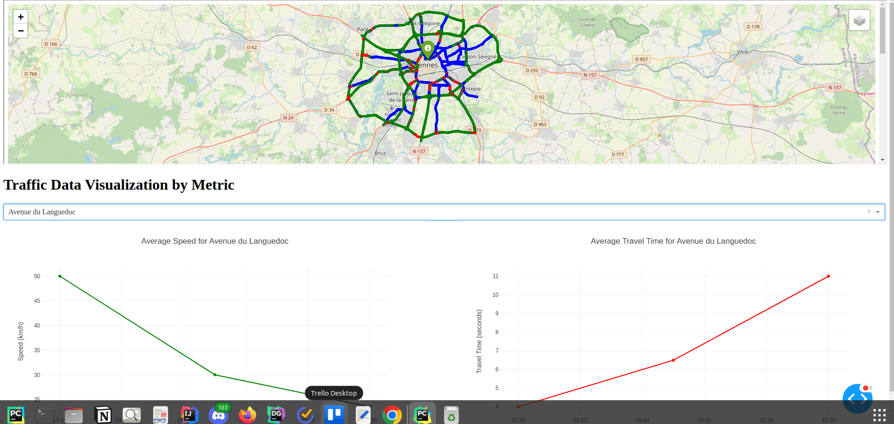
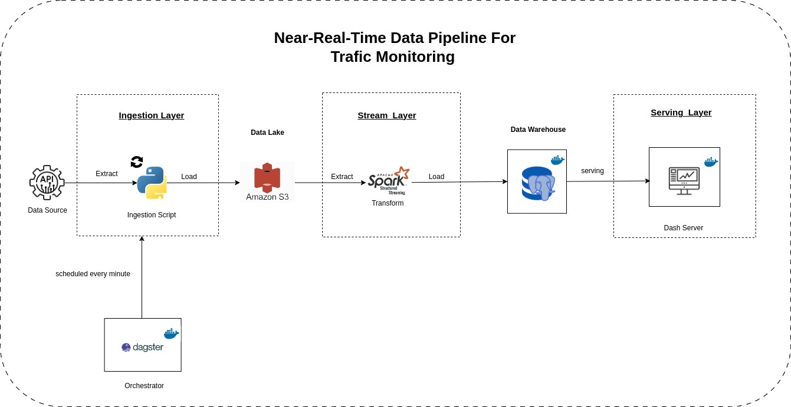

# TrafficWatch: Near-Real-Time Traffic Monitoring Pipeline

## Introduction
TrafficWatch  🚗🚦 is a tool designed to monitor traffic in near-real-time. Imagine you have the power to see the traffic 
status of any road in the city at all in real-time. With TrafficWatch, you can also  visualize the 
average speed, and average travel time based on the road you select.

## The Result
Before diving into the technical details, let's take a look at the final result. 
Using the Renne API, you can access the traffic data source API at the following URL: [https://data.rennesmetropole.fr/api/v1/console/datasets/1.0/search/]
Below is a dynamic map displaying live traffic data, including speed metrics and travel times for different roads. The 
map updates in near real-time, providing an overview of the current traffic conditions.

## How Does It Work?
To achieve this result, a comprehensive data pipeline was implemented, handling everything from data ingestion to visualization. Here's an overview of the pipeline architecture:

### Pipeline Overview
1. **Ingestion Layer**:
    - **Data Source**: Traffic data is retrieved from an external API.
    - **Ingestion Script**: A Python script handles the extraction and loading of this data into a Data Lake on Amazon S3.
    - **Orchestration**: Dagster schedules this process to run every minute, ensuring that the data is continuously updated.

2. **Stream Layer**:
    - **Apache Spark Structured Streaming**: This component processes the data in real-time, transforming raw data into structured information. The processed data is then loaded into a Data Warehouse.

3. **Serving Layer**:
    - **Dash Server**: The data is presented through an interactive dashboard built with Dash, making it accessible and easy to interpret.

## Prerequisites
1. **AWS Account**: You need an AWS account to use services like S3 for storing data.  
2. **AWS Access Keys**: Create AWS access keys (Access Key ID and Secret Access Key) 
3. **Docker and Docker Compose**: These are required to containerize and orchestrate the services.  
4. **Sbt**: This is required to compile and run the structured streaming project.

## Deployment

To set up the TrafficWatch pipeline on your own system, follow these steps:

### 1. **Set up a Data Lake in AWS**:
- You need an AWS account. If you don't have one, you can create it [here](https://aws.amazon.com/).
- Create AWS Access Keys (Access Key ID and Secret Access Key). Follow this [video](https://www.youtube.com/watch?v=KngM5bfpttA)for guidance 
 on how to create AWS Access Keys.
- Create an S3 bucket. In this project, we call it `trafficwatch1`. Note that bucket names in AWS must be unique
  so you will need to define your unique name. This implies to update `dagster-orchestrator/.env` and 
  `structured-streaming/src/main/resources/application.conf` where the bucket name, access key and secret Key are defined.
   as an environment variable.

### 2. **Set up a local Data Warehouse**:
   Follow the readme instructions  [`here`](database-service/README.md) directory to start the database.

### 3. **Set up a local Dagster server**:
Follow the readme instructions [`here`](dagster-orchestrator/README.md) directory to start the Dagster server.

### 4. **Start streaming application**:
Follow the readme instructions [`here`](structured-streaming/README.md) directory to start the Dagster server.

### 5. **Start the dash server**:
Follow the readme instructions [`here`](dash-app/README.md) directory to start the Dagster server.

## Conclusion
TrafficWatch is a powerful tool that provides real-time traffic data visualization. By combining the capabilities of
Dagster, Apache Spark, and Dash, we have created a comprehensive pipeline that ingests, processes, and serves traffic data 
in near real-time. This project demonstrates the potential of data engineering and visualization in solving real-world  
problems.
